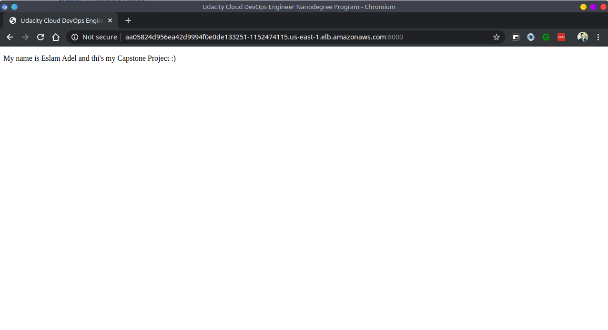

## Cloud DevOps Engineer Capstone Project
In this project,I applied my skills and knowledge i've learned from the Cloud DevOps Nanodegree Program from Udacity :).

### Tasks:

* Working with AWS
* Using Jenkins to implement CI\CD
* Building pipelines
* Working with CloudFormation to deploy clusters
* Building k8s clusters
* Building Docker containers in pipelines

### Requirements:

    Jenkins
    Blue Ocean Plugin in Jenkins
    Pipeline-AWS Plugin in Jenkins
    Docker
    Pip
    AWS Cli
    Eksctl
    Kubectl
    
 ### Output:
 
